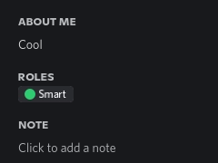
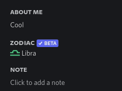
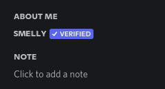
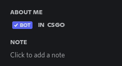

# discord-custom-profile

Add fancy things to your Discord profile using emotes!


## Usage:

- Install [Node.js](https://nodejs.org/en/).
- Clone this repository, or [download](https://github.com/nathanfranke/dcprof/archive/refs/heads/main.zip) and extract the ZIP.
- **Windows**: <kbd>Shift</kbd>+<kbd>Right Click</kbd> in the repository folder and click "Open PowerShell Window Here".
- **Linux/MacOS**: Open a terminal and `cd` to the repository folder.
- Command:
  ```sh
  node index.js 'line1' 'line2' '...'
  ```
  
  Each line can have plain text mixed with segments. Each segment is wrapped in brackets.
  - `<image>` - Adds an image at `items/NAME.png`.
  - `{text}` - Large text, supports alphabetical characters and spaces.
  - `[role]` - Role text. Should be surrounded by `<role_COLOR>` and `<role_end>`, where `COLOR` is `red`, `green`, `blue`, or `yellow`.

## Examples:

- ### Smart
  ```sh
  node index.js 'Cool' '' '{roles}' '<role_green>[Smart]<role_end>'
  ```
  

- ### Zodiac
  (Sorry, `libra` is the only zodiac sign included! Feel free to copy `items/libra.png` and change it.)<br>
  ```sh
  node index.js 'Cool' '' '{zodiac}<beta>' '<libra> Libra'
  ```
  

- ### Smelly
  ```sh
  node index.js '{smelly}<verified>'
  ```
  

- ### Bot
  ```sh
  node index.js '<bot>{ in csgo}'
  ```
  
